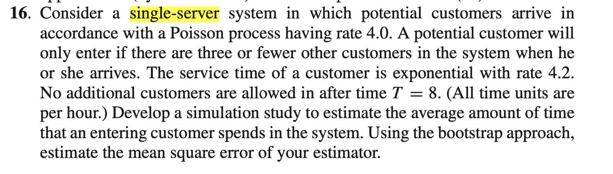

# Bootstrap task
The task is from an assignment from unknown which requires to build a statistics simulation by any programs. The description is down below:

## flow chart
### single run 
1. generate random variable(r.v.) Poisson distribution with rate 4 ``rpois(customer_number, 4)``
2. ``if r.v. < 3:`` go to next step
3. put selected r.v. into Exponential distribution with rate 4.2 ``rexp(1,rate = 4.2)``
4. get time spend for each customer
5. ``(if total_spend > 8):{break}`` end the simulation
6. calculate average time spend in single run

### bootstrap
1. run 1000 times and get a vector
2. write MSE function 
2. bootstrap: sample with replace for 100 times ``boot(vector , bootFunc, R = 100) ``

